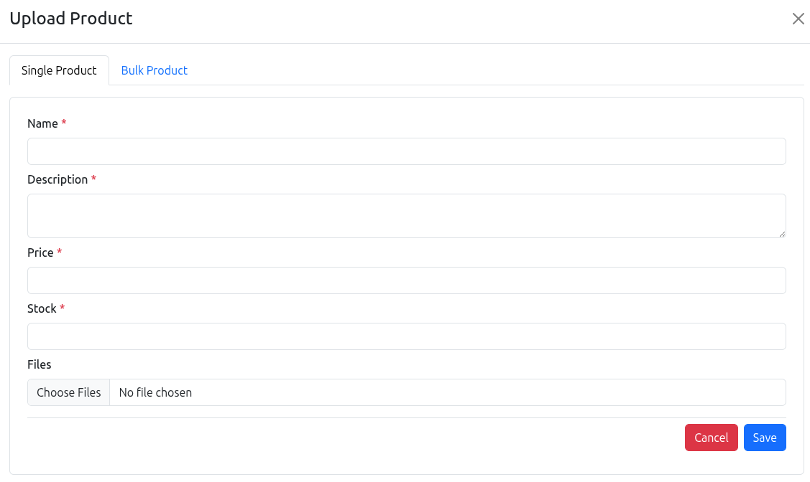
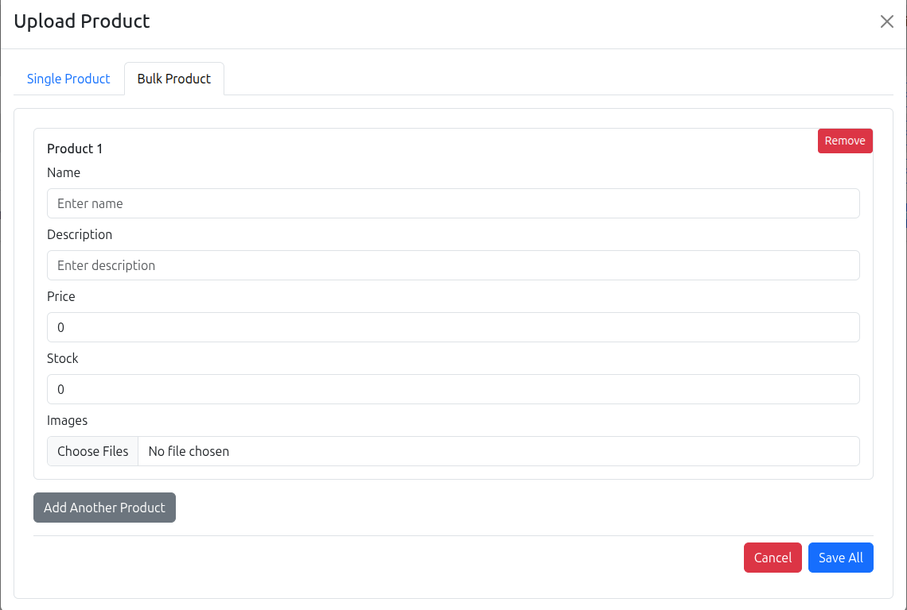
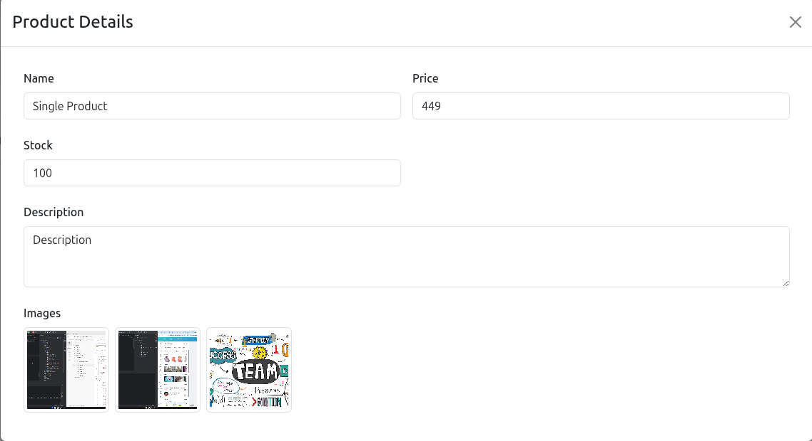
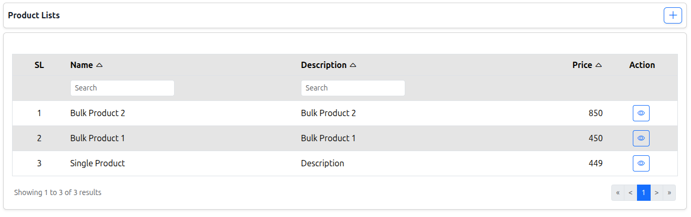

# LAAN TECH ASSESSMENT

A Spring Boot REST API for **bulk product uploads** with image management. Each product gets its own folder where images and metadata JSON are stored. Uploaded images are accessible via browser links.

---

## Description

This project provides APIs to manage products with images efficiently. It allows:

- Uploading a **single product** with multiple images
- Uploading **multiple products at once** (bulk)
- Storing product metadata as JSON files in dedicated folders
- Accessing images via URL to view in a browser

---

## Features

- Single product upload with images
- Bulk product upload
- Images accessible via HTTP URL
- Pagination & sorting support

---

## Tech Stack

- **frontend:** Next.js, TypeScript.
- **Libraries:** react-bootstrap, react-hook-form, react-toastify, sweetalert2, react-redux

---

### Single Product Upload

**POST** `/api/products`

**Payload Example:**

```json
{
  "name": "Single Product",
  "description": "Single Product",
  "price": 450,
  "stock": 100,
  "images": ["file1.png", "file2.png"]
}
```
**Response Example:**

```json
{
"status": 200,
"message": "Product retrieved successfully",
"data":
{
"id": "1ab9e927-c915-4240-8eaf-d934576d7be7",
"name": "Single Product",
"description": "Single Product",
"price": 850,
"files": [
{
"fileName": "file1.png",
"filePath": "/uploads/c672cb2b-6eb4-4905-aaee-c874a96ea3fd/file3.png"
},
{
"fileName": "file2.png",
"filePath": "/uploads/c672cb2b-6eb4-4905-aaee-c874a96ea3fd/file3.png"
}
]
}
}
```

---

### Bulk Product Upload

**POST** `/api/products/bulk-uploads`

**Payload Example:**
```json
[
{
  "name": "Bulk Product 1",
  "description": "Bulk Product Description",
  "price": 450,
  "stock": 100,
  "images": ["file1.png", "file2.png"]
},
  {
    "name": "Bulk Product 2",
    "description": "Bulk Product Description",
    "price": 450,
    "stock": 100,
    "images": ["file1.png", "file2.png"]
  }
]
```
**Response Example:**

```json
{
"status": 200,
"message": "Product retrieved successfully",
"data":
[
  {
    "id": "1ab9e927-c915-4240-8eaf-d934576d7be7",
    "name": "Bulk Product 1",
    "description": "Bulk Product Description",
    "price": 850,
    "stock": 100,
    "files": [
      {
        "fileName": "file1.png",
        "filePath": "/uploads/c672cb2b-6eb4-4905-aaee-c874a96ea3fd/file3.png"
      },
      {
        "fileName": "file2.png",
        "filePath": "/uploads/c672cb2b-6eb4-4905-aaee-c874a96ea3fd/file3.png"
      }
    ]
  },
  {
    "id": "1ab9e927-c915-4240-8eaf-d934576d7be7",
    "name": "Bulk Product 2",
    "description": "Bulk Product Description",
    "price": 850,
    "stock": 100,
    "files": [
      {
        "fileName": "file1.png",
        "filePath": "/uploads/c672cb2b-6eb4-4905-aaee-c874a96ea3fd/file3.png"
      },
      {
        "fileName": "file2.png",
        "filePath": "/uploads/c672cb2b-6eb4-4905-aaee-c874a96ea3fd/file3.png"
      }
    ]
  }
]
}
```

## Product Upload
 

#### Single Product Upload


#### Bulk Product Upload


### Product View



### Product List




## Future Scope

- Add user authentication & authorization
- Add product category support
- Add Dashboard

---

## Authors and Acknowledgment

**Md. Azharul Islam**  
Software Engineer (Full-Stack)  
Phone: +8801787223642
